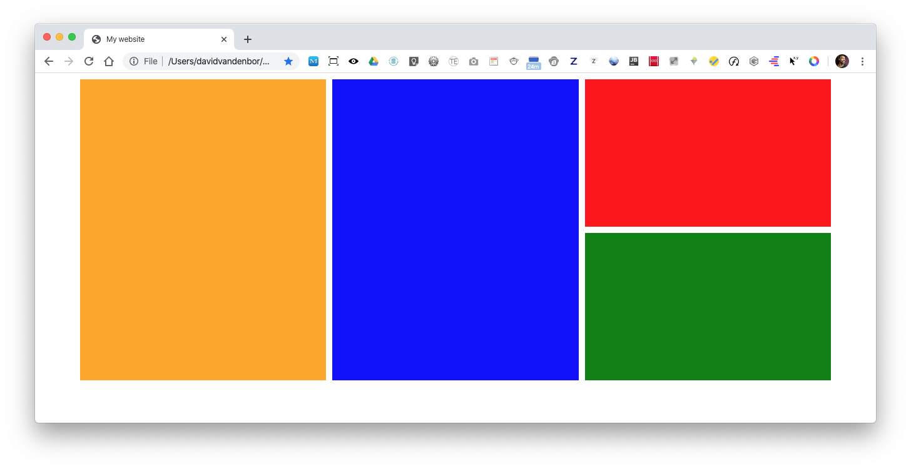

## CSS grid exercise: Grid areas

This grid areas example belongs to 🔗 [this css grid exercise (Dutch language)](https://davidvandenbor.github.io/playgrounds/oefening-css-grid/index.html).  
**The layout below** is recreated during the exercise!! there's also a 🔗 [grid lines version](https://github.com/davidvandenbor/css-grid-lines)

Play around with the code here: https://codesandbox.io/s/github/davidvandenbor/css-grid-areas

