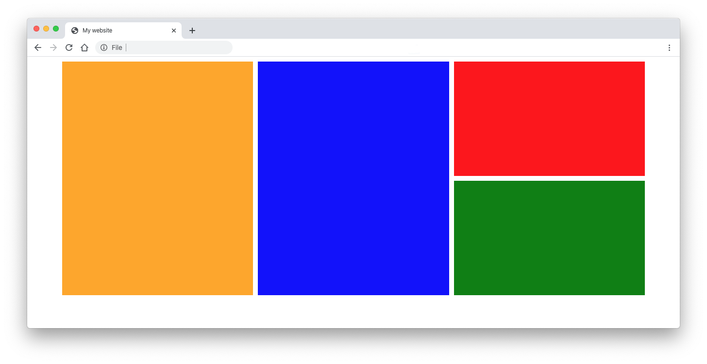

## CSS grid exercise: Grid Lines

This grid areas example belongs to [this css grid exercise](https://davidvandenbor.github.io/playgrounds/oefening-css-grid/index.html).  
**The layout below** is recreated during the exercise!! there's also a :arrow_right: 🔗 :link: [grid lines version](https://github.com/davidvandenbor/css-grid-lines)

#### To the exercise!

Visit the exercise on github pages: [oefening CSS grid](https://davidvandenbor.github.io/playgrounds/oefening-css-grid/index.html)

